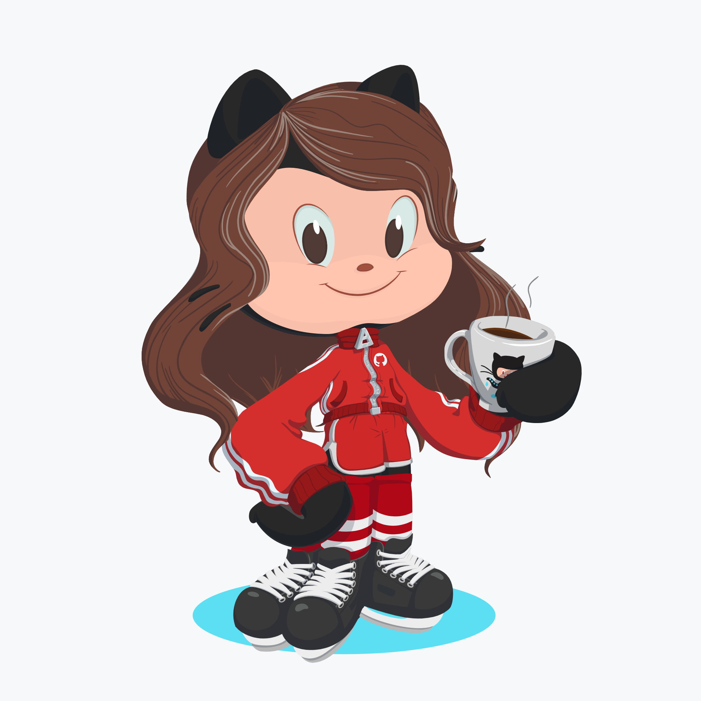

### Hi there 👋

    

 
My heart beats for developing systems and, I truly believe, that we can improve ourselves every day, as well as we also can help people as we can, helping them to reach and raise the best inside them, and, make them spread their best to the world.
I like challenges and I'm also passionate about science, music, and art.

### 🌱 I’m currently learning:
#### Vue

### 🔭 Languages that I already worked with:
1. PHP
2. Java
3. Python

### ⚡ Random facts:
1. I love sharks, and I strongly recommend you to search "Jeff the land shark" on Google hahah
2. I like to drawing and you can see my work here: <a href="http://instagram.com/tocrossbridge" target="_blank">@tocrossbridge</a>

<!--
**wolfhaltz/wolfhaltz** is a ✨ _special_ ✨ repository because its `README.md` (this file) appears on your GitHub profile.

Here are some ideas to get you started:

- 🔭 I’m currently working on ...
- 🌱 I’m currently learning ...
- 👯 I’m looking to collaborate on ...
- 🤔 I’m looking for help with ...
- 💬 Ask me about ...
- 📫 How to reach me: ...
- 😄 Pronouns: ...
- ⚡ Fun fact: ...
-->
